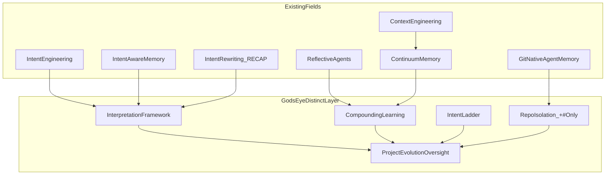

# God's Eye — Similar Concepts Research Map

## Bottom line

Your prior analysis holds up. **No single paper, product, or framework fully matches God's Eye.** The closest matches are **partial overlaps** in research and tooling from 2025–2026. God's Eye is best understood as a **composed architecture** that already exists in your Bible as an interpretation engine + compounding loop + git-native connected chain — not as "better prompting."



---

## Your idea vs. what exists (validated mapping)

| God's Eye pillar | Closest field / artifact | Match strength | Key source |
|------------------|--------------------------|----------------|------------|
| Understand intent, not words | **Intent Engineering** | Very high | [Towards AI — Intent Engineering](https://pub.towardsai.net/intent-engineering-the-missing-layer-in-ai-systems-08fb2bf71453); cumulative communication framing in [Unite.AI](https://www.unite.ai/from-prompt-engineering-to-intent-engineering-the-evolution-of-human-ai-communication/) |
| Formal intent layer (latent goal vs. prompt) | **Intent Signal Theory (IST)** | High (theory) | [arXiv:2605.25058](https://arxiv.org/abs/2605.25058) — distinguishes source intent, proxy, carrier, output |
| Right info + history over time | **Context Engineering** | Very high | Industry shift from prompt → context → intent; CMA treats context as evolving substrate |
| Long-horizon evolving memory | **Continuum Memory Architecture (CMA)** | High | [arXiv:2601.09913](https://arxiv.org/pdf/2601.09913v1) — persistence, mutation, consolidation, temporal continuity |
| Goal-based recall ("calendar" in *this* project) | **Intent-aware memory** | Very high | [STITCH / Contextual Intent](https://contextual-intent.github.io/); [MemGuide](https://arxiv.org/html/2505.20231v2); [MemFlow](https://arxiv.org/html/2605.03312v1) |
| Raw thought → spec → execution | **Intent rewriting / RECAP** | Very high | [RECAP benchmark](https://arxiv.org/html/2509.04472v2); [Megagon overview](https://megagon.ai/agentic-ai-planning-intent-rewriting/) |
| Learn from outcomes, not one-shot | **Reflective / self-improving agents** | High | Reflexion; [Meta-Policy Reflexion](https://arxiv.org/html/2509.03990); [Memento 2 / Stateful Reflective Memory](https://arxiv.org/pdf/2512.22716) |
| Durable project memory in git | **AGENTS.md + git-native memory tools** | Medium–high (adjacent) | [agents.md](https://agents.md/); [agentsge](https://github.com/larsen66/agentsge); [agent-memory](https://github.com/xChuCx/agent-memory); [agent-work-mem](https://github.com/daystar7777/agent-work-mem) |
| Benevolent oversight (not surveillance) | **Bounded autonomy / HITL governance** | Low–medium (different goal) | [Bounded autonomy pattern](https://www.aipatternbook.com/bounded-autonomy.md); [Microsoft AGT](https://github.com/microsoft/agent-governance-toolkit) — safety/approval, not project continuity |

---

## Closest matches (expanded)

### 1. Intent Engineering — strongest philosophical match

Industry framing: move from "phrase the prompt well" to "encode what the system should want and decide toward."

- **Overlap with God's Eye:** Bible §3 interpretation framework — answer intention behind words; continuity across messages; ambiguity resolver with confidence gate ([`docs/37_GODS_EYE.md`](docs/37_GODS_EYE.md) lines 388–422).
- **Gap:** Most intent-engineering writing targets **organizational objectives** (customer retention vs. ticket speed). God's Eye targets **creator/project intent** across months of fragmented chat.

### 2. Intent Signal Theory — strongest academic formalization

IST treats the prompt as a **carrier** for latent source intent and models fidelity loss when private intent is not encoded.

- **Overlap:** Your five-step unclear input and "missing-info recovery" layer map cleanly onto IST's encoding-completeness idea.
- **Gap:** IST is scoped to **single-turn** generation today; God's Eye is explicitly **multi-turn, multi-session, project-scoped**.

### 3. Context Engineering + CMA — strongest memory-architecture match

CMA argues RAG is a "stateless lookup table" and defines memory that **persists, mutates, consolidates, and chains temporally**.

- **Overlap:** God's Eye compounding loop (`Experience → Reflection → Learning → Improvement`) and connected chain (handoff, changelog, learning log).
- **Gap:** CMA is a **runtime memory substrate**; God's Eye is primarily **git-authoritative documentation memory** with optional L4 semantic index ([`docs/GODS_EYE_UNIFIED_STACK.md`](docs/GODS_EYE_UNIFIED_STACK.md) §1, §2).

### 4. STITCH / MemGuide / MemFlow — strongest "goal-aware recall" match

These systems retrieve memory by **current goal/intent**, not keyword similarity alone — exactly your "add calendar → personal intelligence system" example.

- **STITCH:** indexes trajectory steps with contextual intent (goal segment, action type, entity types).
- **MemGuide:** intent-aligned retrieval + slot-guided filtering for multi-session tasks.
- **MemFlow:** externalizes memory planning by query intent tier.
- **Gap:** All are **benchmark/task agents**; none encode **intent ladder** (memory → wire → UI → code) or **ship-signal gating** (§2.8).

### 5. RECAP — strongest "conversation → specification" match

RECAP rewrites messy multi-turn dialogue into a **concise goal representation before planning**.

- **Overlap:** Your pipeline in Bible §3:

```text
Input → Intent detection → Context recovery → Goal prediction
     → Missing-detail reconstruction → Specification generation → Response
```

- **Gap:** RECAP stops at **planning utility**; God's Eye adds **append-only project evolution**, cross-link wiring, and Tier C human-world gate.

### 6. Reflective agents (Reflexion, MPR, Memento 2) — strongest improvement-loop match

These store critiques/reflections and reuse them across attempts or tasks.

- **Overlap:** God's Eye "continuous learning & compounding" and Touch 3 AFTER (changelog + handoff + learning log).
- **Gap:** Reflective agents optimize **task success**; God's Eye optimizes **project understanding + vocabulary + boundaries** with `+#` only and Supersedes — a **documentation epistemology**, not just episodic buffer.

### 7. Git-native agent memory ecosystem — strongest **implementation adjacency**

Tools like `agentsge`, `agent-memory`, and `agent-work-mem` share God's Eye's **markdown-in-git, handoff, MCP** direction. Your repo already ships Phase 2 MCP (`mcp-server/`, [`docs/MCP_SETUP.md`](docs/MCP_SETUP.md)).

- **Overlap:** L0 git truth, `AGENTS.md` entry, session handoff pattern.
- **Gap:** Adjacent tools rarely combine **interpretation engine + intent ladder + compounding doctrine + cross-app standard promotion (§2.7) + project isolation (§2.6)** in one portable Bible.

---

## What makes God's Eye different (confirmed)

Most stacks today look like:

```text
Memory + Context + Intent → better single-session agent behavior
```

God's Eye adds layers visible in your canon but rare as a **single system**:

| Differentiator | Where it lives | Rare elsewhere? |
|----------------|----------------|-----------------|
| **Project as evolving organism** | Handoff + Already done + Recent sessions | Yes — most memory is session/task scoped |
| **Intent ladder default** (memory before code) | Bible §3, §2.8 | Yes — most agents default to implementation |
| **Interpretation engine** (4 layers + continuity + ambiguity %) | Bible §3 | Partial — RECAP/IST cover slices |
| **Compounding learning goal** (not storage) | Bible §1 | Partial — CMA/Reflexion cover slices |
| **Append-only epistemology** (`+#`, Supersedes, never unlearn) | Bible §2.2–§2.3 | Yes — most systems prune/drift |
| **Experience vs. app memory isolation** | Bible §2.6, doc 36 | Yes — prevents cross-repo bleed |
| **Cross-app → standard** (install once) | Bible §2.7, `install.sh` | Yes — reduces re-instruction tax |
| **Benevolent oversight framing** | Identity + Tier C human-world gate | Uncommon as product philosophy (governance tools are safety-first) |

Your proposed academic names remain reasonable:

- **Intent-Centric Evolutionary Context Architecture (ICECA)** — emphasizes intent + evolution + context
- **Persistent Intent Reconstruction System (PIRS)** — emphasizes fragmented-input reconstruction
- **Goal-Aware Continuous Learning Agent** — accessible, less formal

A fourth option grounded in your repo vocabulary: **Git-Native Intent Compounding Architecture (GNICA)** — highlights what is actually shipped (L0–L3 chain) vs. what is research-only elsewhere.

---

## Positioning sentence (research-grade)

> God's Eye is a **git-authoritative, intent-first oversight architecture** that reconstructs latent project goals from fragmented interaction, maintains continuity across sessions, rewrites unclear input into specifications before execution, and compounds learning through append-only project memory — combining intent engineering, context engineering, intent-aware retrieval, conversation rewriting, and reflective improvement into a single **project-evolution** loop rather than a single-session agent trick.

---

## Optional follow-ups (only if you want to act on this research)

These are **memory/wire** tasks — no code unless you later say implement:

1. **Wire a "Related research" section** into [`docs/GODS_EYE_REPO_OVERLAY.md`](docs/GODS_EYE_REPO_OVERLAY.md) or Bible §1 with the table above (`+#` only).
2. **Add adopt/adapt rows** to [`docs/GODS_EYE_UNIFIED_STACK.md`](docs/GODS_EYE_UNIFIED_STACK.md) §2 for IST, CMA, STITCH, RECAP, Reflexion — verdict: **Adapt (conceptual)** / **Reject as replacement**.
3. **Publish a short external-facing positioning blurb** in [`README.md`](README.md) — "fourth camp: git-native intent compounding" vs. RAG-only / chat-only / vector-only memory.
4. **Benchmark gap analysis** — which RECAP/CMA/STITCH behaviors God's Eye MCP tools do or do not yet automate.

No implementation is required for the research question itself; the synthesis above is the deliverable.
