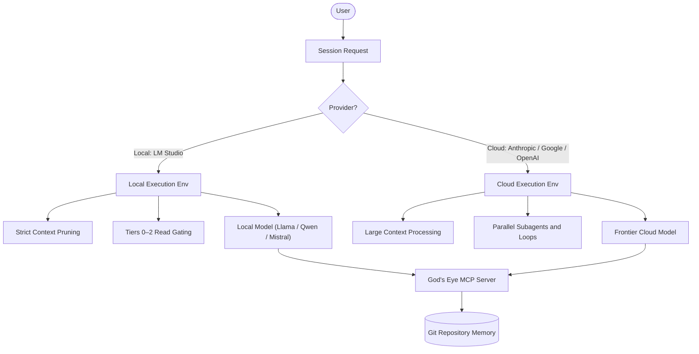

# God's Eye Architecture: Local (LM Studio) vs. Cloud Execution

This document defines the execution modes, optimization strategies, and agent behavioral rules for running God's Eye **with** a local LLM server (LM Studio) versus **without** one (cloud frontier models like Claude, Gemini, or GPT-4o).

**Cross-links:** [`GODS_EYE_REPO_OVERLAY.md`](GODS_EYE_REPO_OVERLAY.md) · [`.cursor/rules/gods-eye-context-intent.mdc`](../.cursor/rules/gods-eye-context-intent.mdc) · [`MCP_SETUP.md`](MCP_SETUP.md) · [`14_SESSION_HANDOFF.md`](14_SESSION_HANDOFF.md)

---

## Architectural Overview

God's Eye is git-native and **environment-agnostic** by design. The rules, overlay, handoff, and MCP server all operate identically regardless of provider. What changes is the **agent's behavioral discipline** — how aggressively it reads context, whether it spawns subagents, and how tightly it manages token budget.

---

## 1. Execution Mode Comparison

| Dimension | Local Mode — With LM Studio | Cloud Mode — Without LM Studio |
|-----------|------------------------------|--------------------------------|
| **Primary driver** | Privacy, offline, zero API cost | Frontier reasoning, massive context |
| **Model class** | 8B – 70B parameter open-weights | Large closed-weights frontier models |
| **Context window** | Constrained — 8k – 32k tokens | Massive — 128k – 2M+ tokens |
| **Cost** | $0 — local GPU/CPU compute | Variable API token fees |
| **Data privacy** | 100% private — nothing leaves the machine | Code and prompts sent to third-party |
| **Parallelization** | Serial, single-agent preferred | Parallel subagents and loop teams supported |
| **Read strategy** | MCP snippet retrieval; rules file only | Full chain parallel batch reads |
| **Memory writes** | Same — `+#` append via MCP or manual | Same — `+#` append via MCP or manual |

---

## 2. Local Mode (With LM Studio)

The agent operates under hardware constraints. The following design principles enforce execution speed and accuracy under limited context:

### A. Strict Context Pruning and Read Tiers (§2.5)

**Problem:** Loading the full Bible (`37_GODS_EYE.md`, 50KB+), overlay, handoff, and rules instantly saturates a local model's context window, causing hallucination and speed drops.

**Design:**
- For Tier 0–1 tasks: read **only** `.cursor/rules/gods-eye-context-intent.mdc` (kept under 3K characters).
- For Tier 2 tasks: add the overlay and the active **Recent sessions** section of the handoff only — not the full file.
- Use the MCP `gods_eye_search_memory` tool to pull targeted snippets instead of loading full docs.
- **Never** batch-read Bible + overlay + handoff + changelog in one turn on a local model.

### B. High-Density Handoff Compaction

**Design:**
- The **Recent sessions** list must stay at a maximum of **5 active lines** in local mode.
- Completed task details must be archived immediately to `docs/02_ENGINEERING_CHANGELOG.md`.
- Target handoff file size: **under 5KB** for smooth local context loading.

### C. Single-Agent Serial Workflows

**Design:**
- Disable subagent spawning by default. Concurrent agents on local machines cause GPU VRAM contention, lag, and hangs.
- All audits, verification, and doc reads must run **serially**.
- Loop cycles (§9) are deferred unless Brent explicitly invokes `/loop`.

### D. Recommended Local Models

| Model | Size | Strength | Best for |
|-------|------|----------|----------|
| **Qwen 2.5 Coder 32B** | 32B | Strong code + instruction following | Code tasks, overlay wiring |
| **Llama 3.1 70B Instruct** | 70B | Broad reasoning | Memory/handoff tasks |
| **Mistral 7B Instruct** | 7B | Fast, low VRAM | Quick Q&A, Tier 0–1 |
| **DeepSeek Coder V2** | 16B | Code generation | Feature implementation |

---

## 3. Cloud Mode (Without LM Studio)

Cloud frontier models unlock the full God's Eye capability stack. The design focuses on maximizing depth, parallelization, and cost control.

### A. Multi-Agent Audits — Six-Team Loop (§9)

**Design:**
- Spawn parallel subagents across Architecture, Engineering, Design/UX, QA, Product, and Tier C lenses simultaneously.
- Synthesize results in a single coordinator pass before writing the `+#` memory step.
- Use `gods_eye_search_memory` for dedup before writing to the chain.

### B. Long-Context Continuity

**Design:**
- The agent digests the full Bible, overlay, handoff, and changelog at session start.
- Deep semantic search across the whole workspace is available for intent reconstruction.
- The full Interpretation framework (§3) pipeline runs at maximum fidelity.

### C. Token-Cost Discipline

**Design:**
- Enforce the **Fresh Thread Law (§2.8)** strictly: at ~80% context capacity, stop, write a handoff entry, and request a fresh thread.
- Batch all `+#` memory writes into a single Touch 3 AFTER pass — never scatter writes across turns.
- Use MCP `gods_eye_append_recent_session` rather than manual file edits to reduce back-and-forth read cycles.

---

## 4. Agent Rules by Execution Mode

These rules are active in `.cursor/rules/gods-eye-context-intent.mdc` and apply every session:

**Local Mode (LM Studio — localhost endpoint):**
1. Read ONLY the rules file + overlay vocabulary; do not load full Bible unless task is Tier 3.
2. No subagent spawning. All audits run serially.
3. Keep handoff Recent sessions to 5 items max; compact older entries to changelog first.
4. Use MCP `gods_eye_search_memory` for targeted snippet retrieval instead of full doc reads.
5. Defer loop cycles and six-team audits unless Brent explicitly invokes `/loop`.

**Cloud Mode (Anthropic / Google / OpenAI endpoint):**
1. Parallel-read Bible, overlay, handoff, and AGENTS.md at session start (§2.4).
2. Spawn parallel subagents for substantial cross-cutting work (§2.8).
3. Enforce fresh thread + handoff at ~80% context capacity (§2.8).
4. Batch all memory writes into one Touch 3 AFTER pass per session.

---

## 5. LM Studio Quick Setup

1. Download [LM Studio](https://lmstudio.ai/) and install a supported model (see §2 recommendations above).
2. Go to the **Local Server** tab → click **Start Server** (default: `http://localhost:1234`).
3. Open Cursor **Settings → Models → Override Base URL**: set to `http://localhost:1234/v1`.
4. Add a dummy API key (e.g., `lm-studio`).
5. Set the model name to match what is loaded in LM Studio (e.g., `qwen2.5-coder-32b-instruct`).
6. Open a new Agent chat — God's Eye rules load automatically via `.cursor/rules/gods-eye-context-intent.mdc`.

The MCP server, handoff files, and all memory chain docs work identically in both modes. The only difference is the agent's read discipline and parallelization strategy as defined in §4 above.
