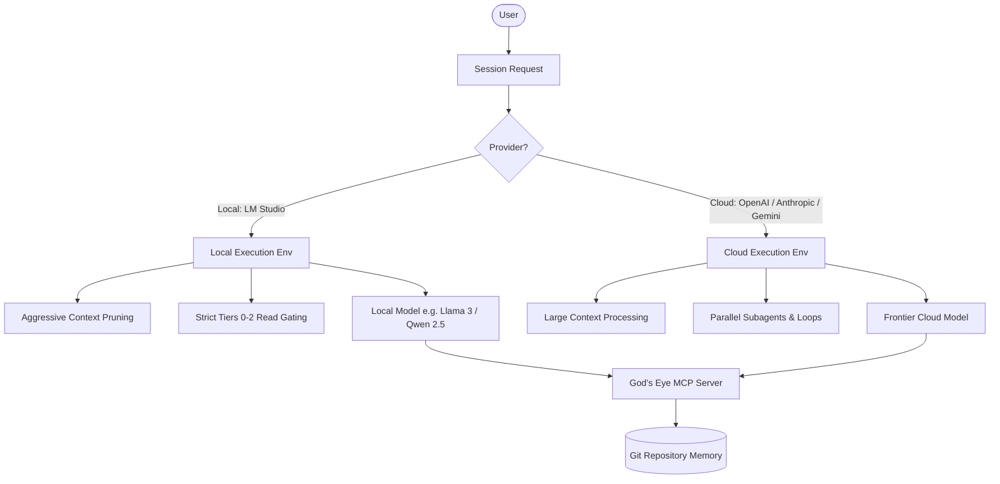

# God's Eye Architecture: Local (LM Studio) vs. Cloud Execution

This document designs the optimization strategies, execution adjustments, and architectural behaviors for running God's Eye **with** a local LLM server (e.g., LM Studio) versus **without** one (using cloud frontier models like Claude 3.5, Gemini 1.5, or GPT-4o).

---

## Architectural Overview

God's Eye (GE) is git-native and environment-agnostic. However, the execution environment changes the cognitive limits, speed, cost, and security of the agent session.



---

## 1. Execution Mode Comparison

| Architectural Dimension | Local Mode (With LM Studio) | Cloud Mode (Without LM Studio) |
|-------------------------|--------------------------------|----------------------------------|
| **Primary Driver**      | Privacy, offline capability, zero API costs. | Frontier reasoning capability, vast context size. |
| **Model Class**         | 8B to 70B parameter open weights models. | Large-scale closed weights frontier models. |
| **Context Window**      | Typically constrained (8k – 32k tokens). | Massive (200k – 2M+ tokens). |
| **Execution Cost**      | $0 (Local compute). | Variable (API token usage fees). |
| **Data Privacy**        | 100% private (No code leaves the machine). | Data transmitted to third-party providers. |
| **Parallelization**     | Serial/single-thread preferred (prevents GPU VRAM bottlenecks). | Parallel subagents and loop teams supported. |

---

## 2. Local Mode Optimization (With LM Studio)

When running God's Eye with LM Studio, the agent operates under hardware constraints (GPU VRAM, local processor latency, and shorter context windows). The following design principles are enforced to maintain execution speed and accuracy:

### A. Strict Context Pruning & Read Tiers
* **The Problem:** Loading a 50KB specification (like `37_GODS_EYE.md`) plus overlay, handoff, and rules instantly consumes a local model's context window, causing hallucination and speed drops.
* **The Design:** 
  * Strict adherence to **Task-Scoped Rules (§2.5)**. For simple tasks, the model is banned from reading the full Bible. It must rely on `.cursor/rules/gods-eye-context-intent.mdc` (which is kept under 3K characters).
  * The MCP search tool (`gods_eye_search_memory`) is used to retrieve snippets instead of loading full documents.

### B. High-Density Handoff Compaction
* **The Design:** Local mode requires keeping `docs/14_SESSION_HANDOFF.md` extremely concise. 
  * The **Recent sessions** list is kept to a maximum of **5 active history items**.
  * Completed task details are immediately archived/compacted into `docs/02_ENGINEERING_CHANGELOG.md` to keep the active handoff file size under 5KB.

### C. Low-Overhead Single-Agent Workflows
* **The Design:** Disable subagent spawning (`invoke_subagent`) by default. Running multiple agents concurrently on local machines causes resource contention, severe lag, and system hangs. All verification and audits must run serially.

---

## 3. Cloud Mode Optimization (Without LM Studio)

When running without LM Studio, you leverage the full reasoning power of cloud frontier models. The design focuses on cost control, deep reasoning, and high-throughput parallel audits.

### A. Multi-Agent Audits (Six-Team Loop §9)
* **The Design:** Cloud models can process massive files and reason about structural drift easily.
  * We spawn parallel subagents to audit code quality, architecture, design/UX, product bounds, and QA alignment simultaneously.
  * This allows the **God's Eye Improvement Loop** to run with deep, multi-perspective reviews in a single turn.

### B. Long-Context Continuity
* **The Design:** The agent can digest the entire repository history, rules, and unified stack files at start-up.
  * The agent can trace dependencies, run deep semantic code searches across the whole workspace, and analyze long chat histories to reconstruct Brent's intent ladder accurately.

### C. Token-Cost Discipline
* **The Design:** Cloud API execution costs scale with context usage.
  * To prevent runaway bills, the **Fresh Thread Law (§2.8)** is strictly enforced. Once the conversation reaches ~80% context capacity, the agent is forced to stop, write a handoff file, and request a fresh thread.

---

## 4. Environment-Aware Rules (Rule Implementation)

We update `.cursor/rules/gods-eye-context-intent.mdc` to dynamically adjust agent behavior based on the detected runtime provider.

```markdown
**Local Mode (LM Studio detected via localhost endpoint):**
1. Enforce strict single-agent execution (no subagents).
2. Read ONLY the rules file and local overlay; do not read full docs unless explicitly requested.
3. Maximize compilation caching and serial audits.

**Cloud Mode (OpenAI/Anthropic/Gemini endpoints):**
1. Utilize parallel tool reads and subagent loops for deep verification.
2. Maintain active token cost discipline (enforce fresh threads at 80% context capacity).
```
