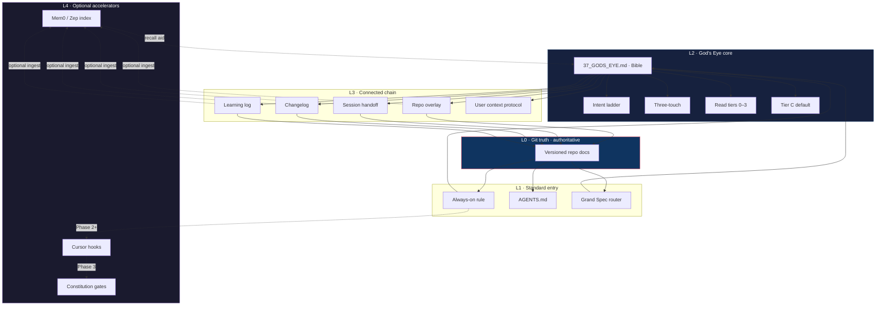
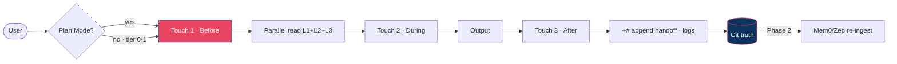

# God's Eye — Unified Stack

**Purpose:** One map for adopting God's Eye alongside common agent-memory patterns — without duplicating portable law or inventing parallel folder trees.

**Authority split (unchanged):** Portable laws live in [`37_GODS_EYE.md`](37_GODS_EYE.md) (God's Eye Bible). This document **routes and composes**; it does not replace the Bible.

**Motto:** *Always watches.* Watch the work. Learn from it. Waste nothing. **Forget nothing.**

Related: [`37_GODS_EYE.md`](37_GODS_EYE.md) · [`GODS_EYE_GRAND_SPEC.md`](GODS_EYE_GRAND_SPEC.md) · [`GODS_EYE_SESSION_TREE.md`](GODS_EYE_SESSION_TREE.md) · [`README.md`](../README.md)

---

## Table of contents

| Topic | § | One-line |
|-------|---|----------|
| **Sixty-second glance** | **0** | Stack layers, git truth, three-touch |
| **L0–L4 architecture** | **1** | Git → entry → core → chain → optional index |
| **Adopt / adapt / reject** | **2** | What to take from Memory Bank, Mem0, Zep, hooks, Plan Mode |
| **Memory Bank mapping** | **3** | Existing doc chain — no `memory-bank/` duplicate |
| **Session handoff** | **4** | `docs/14` pattern + After doc matrix |
| **AGENTS.md entry** | **5** | Standard agent conventions slot |
| **Semantic index (optional)** | **6** | Mem0 / Zep on top of git — git wins |
| **Cursor Plan Mode** | **7** | Aligns with Touch 1 · Before |
| **Hooks & constitution gates** | **8** | Phase 3 soft/hard gates (optional) |
| **Phased roadmap** | **9** | Phase 1 doc · Phase 2 hooks+MCP · Phase 3 gates |
| **Risks** | **10** | Drift, bleed, shadow truth, gate fatigue |
| **Mermaid — unified stack** | **11** | Visual layer map |
| **Project inventory** | **12** | All workspaces with God's Eye — scan + registry |
| **NightRaven monorepo** | **13** | Umbrella brand · `apps/compass` · merge status |

---

## 0. Sixty-second glance

| Question | Answer |
|----------|--------|
| **What is the unified stack?** | God's Eye core + connected chain + optional semantic index and hooks — **git is authoritative** |
| **Do I need Mem0/Zep?** | No — optional L4 accelerators for recall/search; never replace handoff or Bible |
| **Do I need `memory-bank/`?** | **No** — map Memory Bank roles to the existing connected chain (§3) |
| **Where do agents start?** | Rule → Bible §0 → overlay → handoff → `AGENTS.md` (parallel batch) |
| **Three-touch?** | Before → During → After on every real task — see [`GODS_EYE_SESSION_TREE.md`](GODS_EYE_SESSION_TREE.md) |
| **Plan Mode?** | Use for Touch 1 — classify tier, ladder, dedup before edits |
| **First phase?** | **Phase 1 doc-only** — Bible, overlay, handoff, `AGENTS.md`; no hooks required |

---

## 1. L0–L4 architecture layers

The stack builds upward. Lower layers are **required** for a bootstrapped repo; L4 is **optional**.

```text
L4  Optional accelerators     Mem0/Zep index · Cursor hooks · constitution gates
L3  Connected chain           Handoff · changelog · learning log · protocol · overlay
L2  God's Eye core            Bible · +# · intent ladder · three-touch · tiers · Tier C
L1  Standard entry            Always-on rule · AGENTS.md · router (optional)
L0  Git truth (authoritative) Versioned repo docs — reviewable, append-only memory
```

### Layer reference

| Layer | Name | Holds | Required? |
|-------|------|-------|-----------|
| **L0** | **Git truth** | All durable memory in repo paths under version control; PRs and blame apply | **Yes** — source of record |
| **L1** | **Standard entry** | `.cursor/rules/gods-eye-context-intent.mdc` (or equivalent), `AGENTS.md`, optional `GODS_EYE_GRAND_SPEC.md` router | **Yes** for bootstrapped repos |
| **L2** | **God's Eye core** | [`37_GODS_EYE.md`](37_GODS_EYE.md) — `+#` only, intent ladder, read tiers 0–3, three-touch, overlay pattern, Tier C default | **Yes** — portable law |
| **L3** | **Connected chain** | App memory for **this repo only**: overlay, handoff, changelog, learning log, user-context protocol, domain rules | **Yes** when bootstrapped |
| **L4** | **Optional accelerators** | Mem0/Zep semantic recall; implementation skills pack (e.g. agent-skills, post ship-signal); Cursor hooks (`sessionStart`, `stop`, `beforeSubmitPrompt`); BAIC/CORE constitution soft/hard gates | **No** — adopt when recall or enforcement needs justify cost |

### Truth hierarchy

```text
Git docs (L0–L3)  >>>  Semantic index (L4)  >>>  Chat transcript
     authoritative         search aid only         never durable memory
```

If L4 recall disagrees with git, **git wins**. Re-index or append a `+#` correction — do not silently overwrite chain docs from index hits.

### Cross-layer laws (all tiers)

| Law | Layer touch |
|-----|-------------|
| **`+#` only** | L0–L3 memory paths — never `-#` heading blocks |
| **Intent ladder default** | L2 — memory + wire before UI/code |
| **Three-touch** | L2 — Before / During / After every real task |
| **This-repo isolation** | L3 — no cross-repo handoff bleed (Bible §2.6) |
| **Tier C default** | L2 — Creator-Innovator; Product/QA win on boundaries |
| **Always parallel** | L1–L3 — batch-read disjoint paths; one writer per file |
| **Always sync** | L0 — pull before work; commit + push after every change |
| **Governed bypass** | L2 — any rule override requires explicit Brent approval first |

---

## 2. Adopt / adapt / reject

Patterns from the broader agent-memory ecosystem — how God's Eye treats each.

| Pattern | Verdict | God's Eye mapping |
|---------|---------|-------------------|
| **God's Eye Bible** (`37_GODS_EYE.md`) | **Adopt** | L2 portable law — start at §0 |
| **Repo overlay** | **Adopt** | L3 local vocabulary + boundaries — see `examples/overlay/` |
| **`AGENTS.md`** | **Adopt** | L1 agent conventions, build/test, verify policy |
| **Session handoff** (`docs/14_SESSION_HANDOFF.md`) | **Adopt** | L3 current state, **Already done**, **Recent sessions** |
| **Three-touch (Before/During/After)** | **Adopt** | L2 session discipline — [`GODS_EYE_SESSION_TREE.md`](GODS_EYE_SESSION_TREE.md) |
| **Read tiers 0–3** | **Adopt** | L2 ceremony matched to task size (Bible §2.5) |
| **Memory Bank folder tree** (`memory-bank/`) | **Reject duplicate** | **Adapt** roles into connected chain (§3) — one canonical path per concept |
| **Mem0 / Zep** | **Adapt (optional)** | L4 semantic index **on top of** git — never authoritative |
| **addyosmani/agent-skills** | **Adapt (optional L4)** | Consumer app repos only; activate **after** ship signal (`code it` / `implement` / `build`); does not replace Bible, handoff, or intent ladder — see [`CURSOR_INSTALL.md`](CURSOR_INSTALL.md) optional section |
| **Cursor Plan Mode** | **Adapt** | Touch 1 · Before — plan before edit; no separate memory store |
| **Cursor hooks** | **Adapt (Phase 2+)** | L4 automation — session reminders, append nudges, optional gates (§8) |
| **BAIC / CORE constitution hooks** | **Adapt (Phase 3)** | L4 soft/hard gates — optional; must not block trivial fixes by default |
| **Chat-only context** | **Reject** | Wire into L3 or it did not happen |
| **Cross-app pattern re-instructed every session** | **Reject** | Ship in `gods-eye` + install (§2.7) |
| **Transcript as memory** | **Reject** | L0 git docs only; transcripts are debug, not chain |
| **Cross-repo handoff import** | **Reject** | L3 app memory is **this repo only** |
| **`-#` cleanup on logs** | **Reject** | Append **Supersedes** — Bible §2.3 |
| **New template scaffolds per session** | **Reject** | One `+#` in **existing** chain docs (Bible §9) |

---

## 3. Memory Bank → connected chain (no `memory-bank/`)

Many projects use a **Memory Bank** layout (`memory-bank/projectbrief.md`, `activeContext.md`, etc.). God's Eye **does not add a parallel `memory-bank/` tree**. Map each Memory Bank role to an **existing** connected-chain slot so agents have one read path.

| Memory Bank role (typical) | God's Eye connected-chain slot | Notes |
|----------------------------|--------------------------------|-------|
| `projectbrief.md` | `docs/GODS_EYE_REPO_OVERLAY.md` + `README.md` | Product vocabulary + user-facing summary |
| `productContext.md` | Overlay § boundary + `docs/USER_CONTEXT_PROTOCOL.md` | Positioning, worked examples |
| `activeContext.md` | `docs/14_SESSION_HANDOFF.md` — **current focus** section | Ephemeral focus lives in handoff, not a second tree |
| `systemPatterns.md` | `AGENTS.md` + domain `.cursor/rules/*.mdc` | Conventions, architecture notes for agents |
| `techContext.md` | `AGENTS.md` (build/test/stack) + overlay code disambiguation | Stack and tooling |
| `progress.md` | Handoff **Already done** + `docs/02_ENGINEERING_CHANGELOG.md` | Milestones vs chronological log |
| Session notes | Handoff **Recent sessions** | Append every real exit — non-negotiable at tier ≥1 |

### Wiring rule

When migrating from Memory Bank or bootstrapping fresh:

1. **Do not** create `memory-bank/` if the connected chain already covers the role.
2. **Do** add one cross-link row in overlay or router pointing at the canonical file.
3. **Do** append a learning-log entry when a mapping decision is non-obvious (`+#` only).

### Dedup check (Touch 1)

Before adding any new memory file, ask: *Does overlay, handoff, `AGENTS.md`, or Bible §5 already hold this?* If yes — **wire**, don't duplicate.

---

## 4. Session handoff pattern

Handoff is L3 **app memory** — the fastest way for the next agent to see where work left off.

### Canonical shape (`docs/14_SESSION_HANDOFF.md`)

| Section | Purpose | Edit rule |
|---------|---------|-----------|
| **Current state / focus** | What is in flight right now | Update in place for focus; keep history via **Recent sessions** |
| **Already done** | Durable milestones — dedup guard | **Append only** — never remove rows |
| **Recent sessions** | One-liner per session exit | **Append** newest first; keep prior lines |
| **Guardrails / locks** | Behaviors not to break | Extend when new locks appear |

### After doc matrix (three-touch · Touch 3)

From [`GODS_EYE_SESSION_TREE.md`](GODS_EYE_SESSION_TREE.md) §3 — decision order:

| If… | Write (`+#`) |
|-----|--------------|
| Real session exit (tier ≥1) | Handoff **Recent sessions** |
| Meaningful work shipped (tier 2+) | Changelog + wire cross-links |
| Durable milestone completed | **Already done** |
| Reusable pattern discovered | Learning log |
| Agent-facing convention changed | `AGENTS.md` section |

**Record Everything** defaults at tier 2+. Tier 0–1 may skip heavy ceremony — still append **Recent sessions** on real exits when handoff exists.

**Task worthiness (Bible §2.8):** **One** Touch 3 AFTER batch per session — do not stack multiple closes in one thread. Default plan/memory until user says **code it** / **implement** / **build**.

---

## 5. AGENTS.md — standard entry

`AGENTS.md` is the **L1 conventions surface** — how to build, test, verify, and navigate the repo. It is not a second Bible.

| Belongs in `AGENTS.md` | Belongs elsewhere |
|------------------------|-------------------|
| Build / test / lint commands | Portable laws → Bible |
| Verify-before-done checklist | Product vocabulary → overlay |
| Repo layout for agents | Session state → handoff |
| Pointer to God's Eye read order | Intent ladder → Bible §3 |
| Coding conventions | Changelog narrative → `docs/02` |

### Recommended read order (parallel batch)

```text
1. .cursor/rules/gods-eye-context-intent.mdc   (START HERE)
2. docs/37_GODS_EYE.md §0                       (Agent quick start)
3. docs/GODS_EYE_REPO_OVERLAY.md                (if present)
4. docs/GODS_EYE_GRAND_SPEC.md                  (router — if present)
5. Domain rules → USER_CONTEXT_PROTOCOL → handoff → AGENTS.md
```

`AGENTS.md` appears **last** in the batch so conventions sit after product context and current state.

### God's Eye repo note

This published repository is **portable law + examples** — it may not ship a full bootstrapped `AGENTS.md` or `docs/14`. Consumer repos add those at L1/L3 per [`README.md`](../README.md) quick start.

---

## 6. Mem0 / Zep — optional semantic index (L4)

**Mem0** and **Zep** provide long-horizon **semantic recall** — embeddings, entity memory, conversation graphs. In the unified stack they are **optional L4 accelerators**, not a replacement for git-backed chain docs.

### Placement

```text
         ┌─────────────────────┐
         │  Agent session      │
         └──────────┬──────────┘
                    │ read/write
         ┌──────────▼──────────┐
         │  L0–L3 Git chain    │  ◄── authoritative
         └──────────┬──────────┘
                    │ index / ingest (async)
         ┌──────────▼──────────┐
         │  L4 Mem0 / Zep      │  ◄── recall aid
         └─────────────────────┘
```

### Operating rules

| Rule | Detail |
|------|--------|
| **Git authoritative** | Handoff, changelog, Bible, overlay win over index hits |
| **Ingest from git** | Index **derived** from chain docs — not the other way around |
| **No shadow writes** | Index updates do not substitute for `+#` append on L3 docs |
| **Scope** | Per-repo collection — no cross-repo entity bleed (Bible §2.6) |
| **Tier 0–1** | Skip index setup — doc chain is enough |
| **Corrections** | Append **Supersedes** in git; re-ingest index from updated files |

### When to adopt

| Signal | Action |
|--------|--------|
| Large doc chain; agents miss connections | Phase 2 — add MCP or API ingest from handoff + overlay + logs |
| Solo dev; small repo | **Skip** — connected chain + parallel reads suffice |
| Multi-agent parallel writes | **Git first** — index is read-mostly; one writer per file unchanged |

### Implementation skills pack (optional L4)

**addyosmani/agent-skills** and similar lifecycle skill packs sit in the same L4 bucket as Mem0/Zep — **optional**, never authoritative over L0–L3 git chain. God's Eye decides *what the project means and remembers*; implementation skills decide *how to build safely once you say ship*. Same rules as §6: git wins; no vendor into framework repo; consumer app repos only after ship signal. Install pointer: [`CURSOR_INSTALL.md`](CURSOR_INSTALL.md) · plan `.cursor/plans/agent-skills_merge_decision_7be1bdd7.plan.md`.

---

## 7. Cursor Plan Mode — Touch 1 · Before

**Plan Mode** aligns with God's Eye **Touch 1 (Before)** — classify intent, choose read tier, dedup, and agree scope **before** edits.

| Plan Mode phase | God's Eye touch | Actions |
|-----------------|-----------------|---------|
| Understand + plan | **Touch 1 · Before** | Tier classify · intent ladder · MEMORY CHECK · parallel-read chain |
| Execute plan | **Touch 2 · During** | Scope guard · `+#` only on memory · parallel workstreams |
| Summarize + hand off | **Touch 3 · After** | Doc matrix · Tier C gate · append handoff/changelog |

### When to use Plan Mode

| Use Plan Mode | Skip (Agent Mode) |
|---------------|-------------------|
| Cross-cutting refactor, architecture | Tier 0–1 trivial fix |
| Ambiguous "add context" — ladder unclear | Single-file typo with clear scope |
| Tier 3 / improvement loop meta | User named exact file + change |

Plan Mode produces a **plan artifact in chat** — durable outcomes still land in **L3 git docs** via Touch 3. Plans are not a substitute for handoff.

---

## 8. CORE / constitution hooks — Phase 3 gates (optional)

**BAIC / CORE** constitution patterns can attach **soft or hard gates** via Cursor hooks (`.cursor/hooks.json`). These are **L4 optional** — Phase 3 only, after Phase 1 docs and Phase 2 automation prove stable.

### Gate types

| Gate | Hook events (examples) | Behavior |
|------|------------------------|----------|
| **Soft** | `sessionStart`, `stop`, `afterFileEdit` | Remind: append **Recent sessions**, run Tier C check, link Bible §0 |
| **Hard** | `beforeSubmitPrompt`, `preToolUse`, `beforeShellExecution` | Deny when protected path would get `-#`, or destructive command lacks explicit user intent |

### Example soft gate (sessionStart)

Remind agent to parallel-read: rule → Bible §0 → overlay → handoff → `AGENTS.md`.

### Example hard gate (constitution)

Block edits that delete lines from protected memory paths (`docs/04`, `docs/02`, handoff **Already done**) unless prompt contains explicit override token from user.

### Design constraints

| Constraint | Why |
|------------|-----|
| **Fail open for tier 0–1** | Trivial fixes must not stall on ceremony |
| **Project hooks in repo** | Shareable, reviewable — `.cursor/hooks.json` |
| **No duplicate law** | Hooks **enforce** Bible — do not fork portable rules into hook prose |
| **Product/QA override** | Hard gates respect overlay boundaries — Tier C does not bypass |

See Cursor hooks docs and the `create-hook` skill for `hooks.json` schema (`sessionStart`, `stop`, `beforeSubmitPrompt`, etc.).

---

## 9. Phased roadmap

Adopt the stack incrementally. Each phase assumes the prior phase is stable.

### Phase 1 — Doc-only (default / now)

**Goal:** Durable memory in git with zero automation dependencies.

| Deliverable | Layer |
|-------------|-------|
| Vendor or copy [`37_GODS_EYE.md`](37_GODS_EYE.md) | L2 |
| Add `.cursor/rules/gods-eye-context-intent.mdc` | L1 |
| Create `docs/GODS_EYE_REPO_OVERLAY.md` | L3 |
| Bootstrap `docs/14_SESSION_HANDOFF.md`, `AGENTS.md` | L3 / L1 |
| Optional router `GODS_EYE_GRAND_SPEC.md` | L1 |
| Wire README + changelog + learning log | L3 |

**Exit criteria:** Agent can run three-touch on tier 2 work; **Recent sessions** appends on exit; no `memory-bank/` duplicate.

### Phase 2 — Hooks + MCP

**Goal:** Reduce forgotten ceremony; optional semantic recall.

| Deliverable | Layer |
|-------------|-------|
| `sessionStart` soft hook — read-order reminder | L4 |
| `stop` soft hook — "append Recent sessions?" nudge | L4 |
| **God's Eye MCP** — read/search/append memory chain (`mcp-server/`) — see [`MCP_SETUP.md`](MCP_SETUP.md) | L4 |
| Optional Mem0/Zep MCP — ingest from handoff + overlay + logs | L4 |
| Re-ingest script on `+#` commits (CI or manual) | L4 |

**Exit criteria:** Hooks fail open on tier 0–1; index queries cite git paths; git still authoritative.

### Phase 3 — Optional constitution gates

**Goal:** Enforce `+#` only and protected paths for high-risk repos.

| Deliverable | Layer |
|-------------|-------|
| `beforeSubmitPrompt` / `preToolUse` hard gates on protected paths | L4 |
| Constitution checklist hook (BAIC/CORE alignment) | L4 |
| Document override tokens and fail-open policy in overlay | L3 |

**Exit criteria:** Gates documented; Product/QA boundaries tested; bypass path exists for emergencies.

```text
Phase 1 ──► Phase 2 ──► Phase 3
 doc-only     hooks+MCP    hard gates
 required     optional     optional
```

---

## 10. Risks

| Risk | Symptom | Mitigation |
|------|---------|------------|
| **Shadow truth** | Agents trust Mem0/Zep over handoff | Git wins rule (§6); index ingested from git only |
| **Memory Bank duplication** | `memory-bank/` + handoff + overlay say different things | Reject duplicate tree (§3); one canonical slot per concept |
| **Cross-repo bleed** | Handoff imports another app's "Already done" | Bible §2.6; tier 0 isolation |
| **Gate fatigue** | Hooks block every trivial edit | Fail open tier 0–1; hard gates Phase 3 only |
| **Plan without persist** | Plan Mode summary never hits handoff | Touch 3 doc matrix mandatory on exit |
| **Chat-only context** | User "add context" lives in thread | Wire chain + `+#` append (Bible §5) |
| **`-#` cleanup** | "Tidy" logs by deleting history | `+#` only + Supersedes |
| **Template spam** | New checklist files per session | Bible §9 — existing docs only |
| **Tier creep** | Full chain read for one-line fix | Match tier to task (§2.5) |
| **Hook law fork** | Hook prose duplicates Bible | Hooks enforce pointers to §0 — don't rewrite law |
| **Forgotten sync** | Changes committed but not pushed; next agent reads stale state | Always Sync law — pull + push every change |
| **Silent bypass** | Agent skips `+#` rule without asking | Governed Bypass requires explicit approval first |
| **Local-mode subagents** | Spawning parallel agents under LM Studio; VRAM contention, hangs | Serial only in local mode — `docs/GODS_EYE_LOCAL_VS_CLOUD.md` §4 |

---

## 11. Mermaid — unified stack

### Layer stack



### Session flow across layers



---

## 12. Project inventory (all God's Eye workspaces)

Brent runs God's Eye across **multiple repos** plus a **user-global** Cursor install. Aggregate **metadata** lives in [`GODS_EYE_PROJECT_INVENTORY.md`](GODS_EYE_PROJECT_INVENTORY.md) — not a second memory tree.

| Workspace | Role | Phase | Bible |
|-----------|------|-------|-------|
| `Projects/gods-eye` | Published framework | 2 (hooks + installer) | Vendored |
| `Projects/Universal_AI_Project_Operating_System` | Master BAIC | 2 | Canonical source |
| `Developer/NightRaven` | NightRaven app (Xcode: OneDayMillionaire until rename) | 1 | Pointer → UAIPOS |
| `~/.cursor` | User-global rule + hooks | 2 | Pointer → gods-eye |

**Refresh:**

```bash
./scripts/scan-gods-eye-projects.sh
./scripts/scan-gods-eye-projects.sh --markdown   # update inventory scan table
```

Registry file: `scripts/gods-eye-projects.conf` — add a line per new bootstrapped repo.

**Law:** Inventory cites paths and phase adoption only. **Never** paste another repo's handoff **Already done** or locks into this framework repo (Bible §2.6).

---

## Quick reference card

| Phase | You need | You can skip |
|-------|----------|--------------|
| **1** | Bible, rule, overlay, handoff, `AGENTS.md` | Mem0, Zep, hooks |
| **2** | Phase 1 + soft hooks; optional index MCP | Hard gates |
| **3** | Phase 2 + documented hard gates | — unless repo risk demands it |

**Session start (parallel):** rule → Bible §0 → overlay → handoff → `AGENTS.md`

**Every real task:** three-touch · intent ladder default · `+#` only · this-repo dedup · always sync

**Index disagreement:** git wins · append Supersedes · re-ingest

**Local vs cloud:** `docs/GODS_EYE_LOCAL_VS_CLOUD.md` — LM Studio = serial + strict pruning; cloud = parallel + subagents + 80% fresh-thread rule

---

## 13. NightRaven monorepo (umbrella brand)

**NightRaven** is Brent's unified product name. **God's Eye** remains the portable **memory framework** name (L2) — do not rename Bible or `+#` chain to "NightRaven memory."

| Component | Layer | Path |
|-----------|-------|------|
| NightRaven (umbrella) | Brand | [`NIGHTRAVEN_UNIFIED_PRODUCT.md`](NIGHTRAVEN_UNIFIED_PRODUCT.md) |
| God's Eye | L2 framework | Repo root · `docs/37` |
| NightRaven Core | Orchestration | `.claude/skills/nightraven/` |
| NightRaven Compass | App (guidance UI) | `apps/compass/` |
| NightRaven iOS | App (consumer) | External — merge to `apps/ios/` pending |

**Install stack:** `./scripts/install-gods-eye-nightraven.sh TARGET` — still **two layers** (memory + Core); monorepo adds **apps** without collapsing handoffs.

**Cross-links:** [`NIGHTRAVEN_UNIFIED_PRODUCT.md`](NIGHTRAVEN_UNIFIED_PRODUCT.md) · [`apps/README.md`](../apps/README.md) · overlay §1

---

*Established 2026-06-09. Unified stack maps Memory Bank, Mem0/Zep, Plan Mode, and constitution hooks onto God's Eye without duplicating portable law or `memory-bank/` trees. God's Eye always watches.*
