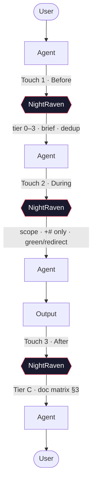
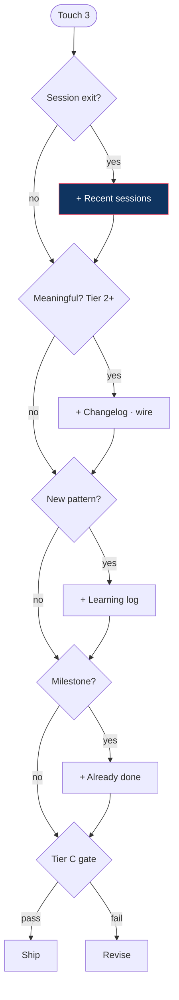
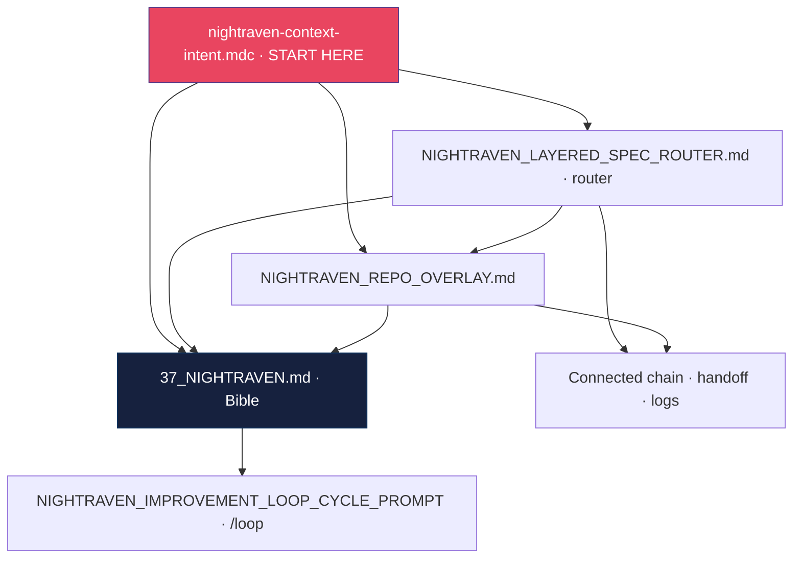

# NightRaven — Session & Spec Trees

**Legend**

| Term | Meaning |
|------|---------|
| **NR** | NightRaven — always-on rules + append-only memory (not a separate bot) |
| **Three-touch** | Before → During → After on every real task (§0) |
| **+# / -#** | Append-only — **+# yes · -# never** |
| **Tier 0–3** | Read depth + ceremony — match task size (Bible §2.5) |
| **Tier C** | Creator-Innovator default; Product/QA win on boundaries (§10) |
| **Record Everything** | Tier 2+ default — full three-touch + mandatory exit writes |

---

## 1. Session interaction flow (one task)

```
USER
 │
 ▼
AGENT ◄───────────────────────────────────────────────────┐
 │                                                         │
 ├──► NR · Touch 1 · BEFORE                               │
 │      tier 0–3 · intent ladder · MEMORY CHECK            │
 │      parallel-read chain (depth ∝ tier)                 │
 │      brief → scope · dedup · Tier C bar                 │
 │         │                                               │
 ◄─────────┘                                               │
 │                                                         │
 ├──► NR · Touch 2 · DURING                                │
 │      scope guard · ladder valid? · +# only              │
 │      no cross-repo · green light / redirect             │
 │         │                                               │
 ◄─────────┘                                               │
 │                                                         │
 ▼                                                         │
OUTPUT  (code · docs · answer)                             │
 │                                                         │
 ├──► NR · Touch 3 · AFTER                                │
 │      Tier C gate · wire links · doc matrix (§3)         │
 │      Record Everything if Tier 2+ · ship or revise     │
 │         │                                               │
 ◄─────────┘                                               │
 │                                                         │
 ▼                                                         │
USER  (memory compounded) ─────────────────────────────────┘
```

**Hop sequence:** `User → Agent → NR → Agent → NR → Agent → Output → NR → Agent → User`

| Touch | §0 | Tier hook | NightRaven returns |
|-------|-----|-----------|------------|
| 1 · Before | Classify intent | Read chain per tier 0–3 | Brief — ladder, scope, dedup |
| 2 · During | Guard scope | Full dedup at Tier 2+ | Green light or redirect |
| 3 · After | Quality gate | Record Everything at Tier 2+ | **+#** writes per §3 matrix |

---

## 2. Tier discipline (Touch 1 · Before)

```
TIER CLASSIFY
│
├── 0 · Experience     new/empty repo
│   └── rule + docs/35 + 36 · NO other repos' handoff
├── 1 · Minimal        trivial fix · low risk (bootstrapped)
│   └── §0 · overlay if product · handoff scan if present
├── 2 · Standard       feature · bug · doc update  ◄── Record Everything default
│   └── full chain + docs/14 dedup · exit writes (§3)
└── 3 · Loop           refactor · /loop meta only
    └── §9–§10 · six teams · one +# per cycle
```

| Tier | When | After writes |
|------|------|--------------|
| 0 | New/empty repo | Only if Brent adds context |
| 1 | Trivial bootstrapped | **Recent sessions** on real exit |
| 2 | Standard work | **Record Everything** (§3) |
| 3 | Cross-cutting / `/loop` | Loop law: one +# + wire + logs |

**All tiers:** +# only · parallel reads · intent ladder · this-repo dedup · Tier C posture · **always sync** (pull before; push after).

---

## 3. Record Everything mode + After doc matrix

Three-touch always. **Recent sessions on every real session exit — non-negotiable.** **Always sync: `git pull` before Touch 1; `git push` after Touch 3.**

```
RECORD EVERYTHING · Touch 3 · AFTER          DECISION TREE (ask in order)
│                                          │
├── ALWAYS (exit · tier ≥1)                ├─ Session ending? → Recent sessions (+#)
│   └── docs/14 Recent sessions (+#)       ├─ Meaningful work? → changelog · wire
│                                          ├─ Milestone done? → Already done (+#)
├── MEANINGFUL (Tier 2+)                   ├─ New pattern? → learning log (+#)
│   ├── docs/02 changelog (+#)             ├─ Convention change? → AGENTS (+#)
│   ├── docs/14 Already done (+#)          └─ Tier C gate → ship · else revise
│   └── wire cross-links
│
├── NEW PATTERN → docs/04 learning log (+#)
├── CONVENTION → AGENTS.md (+# section)
│
└── NEVER: -# · new templates · /loop for app fixes
```

| If… | Write (+#) | Skip when… |
|-----|------------|------------|
| Real session exit | Handoff **Recent sessions** | **Never** |
| Code/docs shipped (Tier 2+) | Changelog + wire links | Tier 0–1 typo |
| Durable milestone | **Already done** | In-progress only |
| Reusable lesson | Learning log | One-off |
| Agent convention shift | AGENTS.md | No agent-facing change |
| Brent adds context | Full chain wire (§5) | Chat-only |
| `/loop` meta | One +# in existing docs (§9) | App fixes |

---

## 4. Doc / spec hierarchy (portable → wired)

```
GODS EYE FRAMEWORK
│
├── PORTABLE · 37_NIGHTRAVEN.md (NightRaven Bible)
│   §0 quick start · §2 laws/tiers · §3 ladder · §5 chain · §9 loop · §10 Tier C
│
├── LOCAL (bootstrapped repo)
│   ├── NIGHTRAVEN_REPO_OVERLAY.md · vocabulary · boundary
│   └── NIGHTRAVEN_LAYERED_SPEC_ROUTER.md · router → Bible §0
│
├── ALWAYS-ON · nightraven-context-intent.mdc · START HERE
│
├── CONNECTED CHAIN (this repo only)
│   domain rule · USER_CONTEXT_PROTOCOL · docs/14 handoff
│   AGENTS.md · docs/02 changelog · docs/04 learning log
│
└── META (/loop only) · NIGHTRAVEN_IMPROVEMENT_LOOP_CYCLE_PROMPT · IMPROVEMENT_LOOP_CYCLE_PROMPT
```

**Read order:** Rule → Bible §0 → Overlay → Router → chain → AGENTS.md

---

## 5. Mermaid diagrams

### Session flow



### Record Everything (After touch)



### Doc hierarchy



---

*NightRaven always watches · watch the work · learn from it · waste nothing · forget nothing.*
